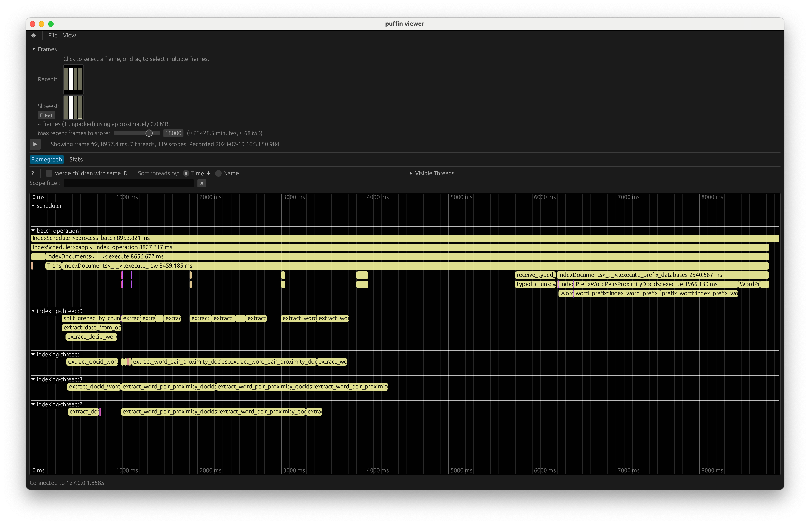

# Profiling Meilisearch

Search engine technologies are complex pieces of software that require thorough profiling tools. We chose to use [Puffin](https://github.com/EmbarkStudios/puffin), which the Rust gaming industry uses extensively. You can export and import the profiling reports using the top bar's _File_ menu options [in Puffin Viewer](https://github.com/embarkstudios/puffin#ui).

## Profiling the Indexing Process

When you enable [the `exportPuffinReports` experimental feature](https://www.meilisearch.com/docs/learn/experimental/overview) of Meilisearch, Puffin reports with the `.puffin` extension will be automatically exported to disk. When this option is enabled, the engine will automatically create a "frame" whenever it executes the `IndexScheduler::tick` method.

[Puffin Viewer](https://github.com/EmbarkStudios/puffin/tree/main/puffin_viewer) is used to analyze the reports. Those reports show areas where Meilisearch spent time during indexing.

Another piece of advice on the Puffin viewer UI interface is to consider the _Merge children with same ID_ option. It can hide the exact actual timings at which events were sent. Please turn it off when you see strange gaps on the Flamegraph. It can help.

## Profiling the Search Process

We still need to take the time to profile the search side of the engine with Puffin. It would require time to profile the filtering phase, query parsing, creation, and execution. We could even profile the Actix HTTP server.

The only issue we see is the framing system. Puffin requires a global frame-based profiling phase, which collides with Meilisearch's ability to accept and answer multiple requests on different threads simultaneously.
