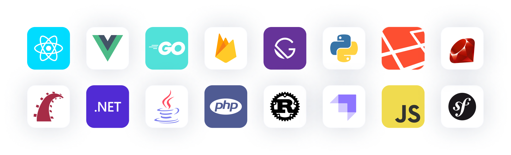

  
  

<h4 align="center">
  <a href="https://www.meilisearch.com/?utm_campaign=oss&utm_source=github&utm_medium=meilisearch&utm_content=nav">Website</a> |
  <a href="https://roadmap.meilisearch.com/tabs/1-under-consideration">Roadmap</a> |
  <a href="https://www.meilisearch.com/pricing?utm_campaign=oss&utm_source=github&utm_medium=meilisearch&utm_content=nav">Meilisearch Cloud</a> |
  <a href="https://blog.meilisearch.com/?utm_campaign=oss&utm_source=github&utm_medium=meilisearch&utm_content=nav">Blog</a> |
  <a href="https://www.meilisearch.com/docs?utm_campaign=oss&utm_source=github&utm_medium=meilisearch&utm_content=nav">Documentation</a> |
  <a href="https://www.meilisearch.com/docs/faq?utm_campaign=oss&utm_source=github&utm_medium=meilisearch&utm_content=nav">FAQ</a> |
  <a href="https://discord.meilisearch.com/?utm_campaign=oss&utm_source=github&utm_medium=meilisearch&utm_content=nav">Discord</a>
</h4>

  
  
  

⚡ A lightning-fast search engine that fits effortlessly into your apps, websites, and workflow 🔍

[Meilisearch](https://www.meilisearch.com?utm_campaign=oss&utm_source=github&utm_medium=meilisearch&utm_content=intro) helps you shape a delightful search experience in a snap, offering features that work out of the box to speed up your workflow.

  
  

## 🖥 Examples

- [**Movies**](https://where2watch.meilisearch.com/?utm_campaign=oss&utm_source=github&utm_medium=organization) — An application to help you find streaming platforms to watch movies using [hybrid search](https://www.meilisearch.com/solutions/hybrid-search?utm_campaign=oss&utm_source=github&utm_medium=meilisearch&utm_content=demos).
- [**Flickr**](https://flickr.meilisearch.com/?utm_campaign=oss&utm_source=github&utm_medium=organization) — Search and explore one hundred million Flickr images with semantic search.
- [**Ecommerce**](https://ecommerce.meilisearch.com/?utm_campaign=oss&utm_source=github&utm_medium=meilisearch&utm_content=demos) — Ecommerce website using disjunctive [facets](https://www.meilisearch.com/docs/learn/fine_tuning_results/faceted_search?utm_campaign=oss&utm_source=github&utm_medium=meilisearch&utm_content=demos), range and rating filtering, and pagination.
- [**Songs**](https://music.meilisearch.com/?utm_campaign=oss&utm_source=github&utm_medium=meilisearch&utm_content=demos) — Search through 47 million of songs.
- [**SaaS**](https://saas.meilisearch.com/?utm_campaign=oss&utm_source=github&utm_medium=meilisearch&utm_content=demos) — Search for contacts, deals, and companies in this [multi-tenant](https://www.meilisearch.com/docs/learn/security/multitenancy_tenant_tokens?utm_campaign=oss&utm_source=github&utm_medium=meilisearch&utm_content=demos) CRM application.

See the list of all our example apps in our [demos repository](https://github.com/meilisearch/demos).

## ✨ Features
- **Hybrid search:** Combine the best of both [semantic](https://www.meilisearch.com/docs/learn/experimental/vector_search?utm_campaign=oss&utm_source=github&utm_medium=meilisearch&utm_content=features) & full-text search to get the most relevant results
- **Search-as-you-type:** Find & display results in less than 50 milliseconds to provide an intuitive experience
- **[Typo tolerance](https://www.meilisearch.com/docs/learn/relevancy/typo_tolerance_settings?utm_campaign=oss&utm_source=github&utm_medium=meilisearch&utm_content=features):** get relevant matches even when queries contain typos and misspellings
- **[Filtering](https://www.meilisearch.com/docs/learn/fine_tuning_results/filtering?utm_campaign=oss&utm_source=github&utm_medium=meilisearch&utm_content=features) and [faceted search](https://www.meilisearch.com/docs/learn/fine_tuning_results/faceted_search?utm_campaign=oss&utm_source=github&utm_medium=meilisearch&utm_content=features):** enhance your users' search experience with custom filters and build a faceted search interface in a few lines of code
- **[Sorting](https://www.meilisearch.com/docs/learn/fine_tuning_results/sorting?utm_campaign=oss&utm_source=github&utm_medium=meilisearch&utm_content=features):** sort results based on price, date, or pretty much anything else your users need
- **[Synonym support](https://www.meilisearch.com/docs/learn/relevancy/synonyms?utm_campaign=oss&utm_source=github&utm_medium=meilisearch&utm_content=features):** configure synonyms to include more relevant content in your search results
- **[Geosearch](https://www.meilisearch.com/docs/learn/fine_tuning_results/geosearch?utm_campaign=oss&utm_source=github&utm_medium=meilisearch&utm_content=features):** filter and sort documents based on geographic data
- **[Extensive language support](https://www.meilisearch.com/docs/learn/what_is_meilisearch/language?utm_campaign=oss&utm_source=github&utm_medium=meilisearch&utm_content=features):** search datasets in any language, with optimized support for Chinese, Japanese, Hebrew, and languages using the Latin alphabet
- **[Security management](https://www.meilisearch.com/docs/learn/security/master_api_keys?utm_campaign=oss&utm_source=github&utm_medium=meilisearch&utm_content=features):** control which users can access what data with API keys that allow fine-grained permissions handling
- **[Multi-Tenancy](https://www.meilisearch.com/docs/learn/security/multitenancy_tenant_tokens?utm_campaign=oss&utm_source=github&utm_medium=meilisearch&utm_content=features):** personalize search results for any number of application tenants
- **Highly Customizable:** customize Meilisearch to your specific needs or use our out-of-the-box and hassle-free presets
- **[RESTful API](https://www.meilisearch.com/docs/reference/api/overview?utm_campaign=oss&utm_source=github&utm_medium=meilisearch&utm_content=features):** integrate Meilisearch in your technical stack with our plugins and SDKs
- **AI-ready:** works out of the box with [langchain](https://www.meilisearch.com/with/langchain) and the [model context protocol](https://github.com/meilisearch/meilisearch-mcp)
- **Easy to install, deploy, and maintain**

## 📖 Documentation

You can consult Meilisearch's documentation at [meilisearch.com/docs](https://www.meilisearch.com/docs/?utm_campaign=oss&utm_source=github&utm_medium=meilisearch&utm_content=docs).

## 🚀 Getting started

For basic instructions on how to set up Meilisearch, add documents to an index, and search for documents, take a look at our [documentation](https://www.meilisearch.com/docs?utm_campaign=oss&utm_source=github&utm_medium=meilisearch&utm_content=get-started) guide.

## 🌍 Supercharge your Meilisearch experience

Say goodbye to server deployment and manual updates with [Meilisearch Cloud](https://www.meilisearch.com/cloud?utm_campaign=oss&utm_source=github&utm_medium=meilisearch). Additional features include analytics & monitoring in many regions around the world. No credit card is required.

## 🧰 SDKs & integration tools

Install one of our SDKs in your project for seamless integration between Meilisearch and your favorite language or framework!

Take a look at the complete [Meilisearch integration list](https://www.meilisearch.com/docs/learn/what_is_meilisearch/sdks?utm_campaign=oss&utm_source=github&utm_medium=meilisearch&utm_content=sdks-link).

## ⚙️ Advanced usage

Experienced users will want to keep our [API Reference](https://www.meilisearch.com/docs/reference/api/overview?utm_campaign=oss&utm_source=github&utm_medium=meilisearch&utm_content=advanced) close at hand.

We also offer a wide range of dedicated guides to all Meilisearch features, such as [filtering](https://www.meilisearch.com/docs/learn/fine_tuning_results/filtering?utm_campaign=oss&utm_source=github&utm_medium=meilisearch&utm_content=advanced), [sorting](https://www.meilisearch.com/docs/learn/fine_tuning_results/sorting?utm_campaign=oss&utm_source=github&utm_medium=meilisearch&utm_content=advanced), [geosearch](https://www.meilisearch.com/docs/learn/fine_tuning_results/geosearch?utm_campaign=oss&utm_source=github&utm_medium=meilisearch&utm_content=advanced), [API keys](https://www.meilisearch.com/docs/learn/security/master_api_keys?utm_campaign=oss&utm_source=github&utm_medium=meilisearch&utm_content=advanced), and [tenant tokens](https://www.meilisearch.com/docs/learn/security/tenant_tokens?utm_campaign=oss&utm_source=github&utm_medium=meilisearch&utm_content=advanced).

Finally, for more in-depth information, refer to our articles explaining fundamental Meilisearch concepts such as [documents](https://www.meilisearch.com/docs/learn/core_concepts/documents?utm_campaign=oss&utm_source=github&utm_medium=meilisearch&utm_content=advanced) and [indexes](https://www.meilisearch.com/docs/learn/core_concepts/indexes?utm_campaign=oss&utm_source=github&utm_medium=meilisearch&utm_content=advanced).

## 🧾 Editions & Licensing

Meilisearch is available in two editions:

### 🧪 Community Edition (CE)

- Fully open source under the [MIT license](./LICENSE)
- Core search engine with fast and relevant full-text, semantic or hybrid search
- Free to use for anyone, including commercial usage

### 🏢 Enterprise Edition (EE)

- Includes advanced features such as:
  - Sharding
- Governed by a [commercial license](./LICENSE-EE) or the [Business Source License 1.1](https://mariadb.com/bsl11)
- Not allowed in production without a commercial agreement with Meilisearch.
  - You may use, modify, and distribute the Licensed Work for non-production purposes only, such as testing, development, or evaluation.

Want access to Enterprise features? → Contact us at [sales@meilisearch.com](maito:sales@meilisearch.com).

## 📊 Telemetry

Meilisearch collects **anonymized** user data to help us improve our product. You can [deactivate this](https://www.meilisearch.com/docs/learn/what_is_meilisearch/telemetry?utm_campaign=oss&utm_source=github&utm_medium=meilisearch&utm_content=telemetry#how-to-disable-data-collection) whenever you want.

To request deletion of collected data, please write to us at [privacy@meilisearch.com](mailto:privacy@meilisearch.com). Remember to include your `Instance UID` in the message, as this helps us quickly find and delete your data.

If you want to know more about the kind of data we collect and what we use it for, check the [telemetry section](https://www.meilisearch.com/docs/learn/what_is_meilisearch/telemetry?utm_campaign=oss&utm_source=github&utm_medium=meilisearch&utm_content=telemetry#how-to-disable-data-collection) of our documentation.

## 📫 Get in touch!

Meilisearch is a search engine created by [Meili](https://www.meilisearch.com/careers), a software development company headquartered in France and with team members all over the world. Want to know more about us? [Check out our blog!](https://blog.meilisearch.com/?utm_campaign=oss&utm_source=github&utm_medium=meilisearch&utm_content=contact)

🗞 [Subscribe to our newsletter](https://share-eu1.hsforms.com/1LN5N0x_GQgq7ss7tXmSykwfg3aq) if you don't want to miss any updates! We promise we won't clutter your mailbox: we only send one edition every two months.

💌 Want to make a suggestion or give feedback? Here are some of the channels where you can reach us:

- For feature requests, please visit our [product repository](https://github.com/meilisearch/product/discussions)
- Found a bug? Open an [issue](https://github.com/meilisearch/meilisearch/issues)!
- Want to be part of our Discord community? [Join us!](https://discord.meilisearch.com/?utm_campaign=oss&utm_source=github&utm_medium=meilisearch&utm_content=contact)

Thank you for your support!

## 👩‍💻 Contributing

Meilisearch is, and will always be, open-source! If you want to contribute to the project, please look at [our contribution guidelines](CONTRIBUTING.md).

## 📦 Versioning

Meilisearch releases and their associated binaries are available on the project's [releases page](https://github.com/meilisearch/meilisearch/releases).

The binaries are versioned following [SemVer conventions](https://semver.org/). To know more, read our [versioning policy](./documentation/versioning-policy.md).

Differently from the binaries, crates in this repository are not currently available on [crates.io](https://crates.io/) and do not follow [SemVer conventions](https://semver.org).
