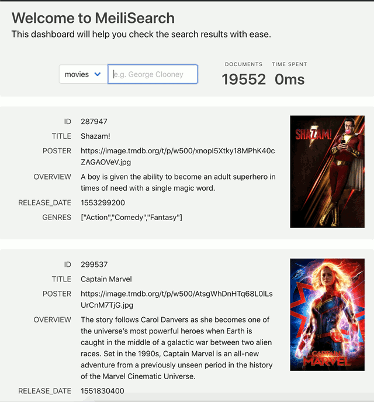

<p align="center">
  
</p>

<h1 align="center">MeiliSearch</h1>

<h4 align="center">
  <a href="https://www.meilisearch.com">Website</a> |
  <a href="https://roadmap.meilisearch.com/tabs/1-under-consideration">Roadmap</a> |
  <a href="https://blog.meilisearch.com">Blog</a> |
  <a href="https://fr.linkedin.com/company/meilisearch">LinkedIn</a> |
  <a href="https://twitter.com/meilisearch">Twitter</a> |
  <a href="https://docs.meilisearch.com">Documentation</a> |
  <a href="https://docs.meilisearch.com/faq/">FAQ</a>
</h4>

<p align="center">
  <a href="https://github.com/meilisearch/MeiliSearch/actions"></a>
  <a href="https://deps.rs/repo/github/meilisearch/MeiliSearch"></a>
  <a href="https://github.com/meilisearch/MeiliSearch/blob/main/LICENSE"></a>
  <a href="https://slack.meilisearch.com"></a>
  <a href="https://github.com/meilisearch/MeiliSearch/discussions" alt="Discussions"></a>
  <a href="https://app.bors.tech/repositories/26457"></a>
</p>

<p align="center">⚡ Lightning Fast, Ultra Relevant, and Typo-Tolerant Search Engine 🔍</p>

**MeiliSearch** is a powerful, fast, open-source, easy to use and deploy search engine. Both searching and indexing are highly customizable. Features such as typo-tolerance, filters, and synonyms are provided out-of-the-box.
For more information about features go to [our documentation](https://docs.meilisearch.com/).

<p align="center">
  
</p>

## ✨ Features
* Search as-you-type experience (answers < 50 milliseconds)
* Full-text search
* Typo tolerant (understands typos and miss-spelling)
* Faceted search and filters
* Supports Kanji characters
* Supports Synonym
* Easy to install, deploy, and maintain
* Whole documents are returned
* Highly customizable
* RESTful API

## Getting started

### Deploy the Server

#### Homebrew (Mac OS)

```bash
brew update && brew install meilisearch
meilisearch
```

#### Docker

```bash
docker run -p 7700:7700 -v "$(pwd)/data.ms:/data.ms" getmeili/meilisearch
```

#### Try MeiliSearch in our Sandbox

Create a MeiliSearch instance in [MeiliSearch Sandbox](https://sandbox.meilisearch.com/). This instance is free, and will be active for 72 hours.

#### Run on Digital Ocean

[](https://marketplace.digitalocean.com/apps/meilisearch?action=deploy&refcode=7c67bd97e101)

#### Deploy on Platform.sh

<a href="https://console.platform.sh/projects/create-project?template=https://raw.githubusercontent.com/platformsh/template-builder/master/templates/meilisearch/.platform.template.yaml&utm_content=meilisearch&utm_source=github&utm_medium=button&utm_campaign=deploy_on_platform">
    
</a>

#### APT (Debian & Ubuntu)

```bash
echo "deb [trusted=yes] https://apt.fury.io/meilisearch/ /" > /etc/apt/sources.list.d/fury.list
apt update && apt install meilisearch-http
meilisearch
```

#### Download the binary (Linux & Mac OS)

```bash
curl -L https://install.meilisearch.com | sh
./meilisearch
```

#### Compile and run it from sources

If you have the latest stable Rust toolchain installed on your local system, clone the repository and change it to your working directory.

```bash
git clone https://github.com/meilisearch/MeiliSearch.git
cd MeiliSearch
cargo run --release
```

### Create an Index and Upload Some Documents

Let's create an index! If you need a sample dataset, use [this movie database](https://www.notion.so/meilisearch/A-movies-dataset-to-test-Meili-1cbf7c9cfa4247249c40edfa22d7ca87#b5ae399b81834705ba5420ac70358a65). You can also find it in the `datasets/` directory.

```bash
curl -L 'https://bit.ly/2PAcw9l' -o movies.json
```

MeiliSearch can serve multiple indexes, with different kinds of documents.
It is required to create an index before sending documents to it.

```bash
curl -i -X POST 'http://127.0.0.1:7700/indexes' --data '{ "name": "Movies", "uid": "movies" }'
```

Now that the server knows about your brand new index, you're ready to send it some data.

```bash
curl -i -X POST 'http://127.0.0.1:7700/indexes/movies/documents' \
  --header 'content-type: application/json' \
  --data-binary @movies.json
```

### Search for Documents

#### In command line

The search engine is now aware of your documents and can serve those via an HTTP server.

The [`jq` command-line tool](https://stedolan.github.io/jq/) can greatly help you read the server responses.

```bash
curl 'http://127.0.0.1:7700/indexes/movies/search?q=botman+robin&limit=2' | jq
```

```json
{
  "hits": [
    {
      "id": "415",
      "title": "Batman & Robin",
      "poster": "https://image.tmdb.org/t/p/w1280/79AYCcxw3kSKbhGpx1LiqaCAbwo.jpg",
      "overview": "Along with crime-fighting partner Robin and new recruit Batgirl...",
      "release_date": "1997-06-20",
    },
    {
      "id": "411736",
      "title": "Batman: Return of the Caped Crusaders",
      "poster": "https://image.tmdb.org/t/p/w1280/GW3IyMW5Xgl0cgCN8wu96IlNpD.jpg",
      "overview": "Adam West and Burt Ward returns to their iconic roles of Batman and Robin...",
      "release_date": "2016-10-08",
    }
  ],
  "offset": 0,
  "limit": 2,
  "processingTimeMs": 1,
  "query": "botman robin"
}
```

#### Use the Web Interface

We also deliver an **out-of-the-box web interface** in which you can test MeiliSearch interactively.

You can access the web interface in your web browser at the root of the server. The default URL is [http://127.0.0.1:7700](http://127.0.0.1:7700). All you need to do is open your web browser and enter MeiliSearch’s address to visit it. This will lead you to a web page with a search bar that will allow you to search in the selected index.

| [See the gif above](#demo)

## Documentation

Now that your MeiliSearch server is up and running, you can learn more about how to tune your search engine in [the documentation](https://docs.meilisearch.com).

## Contributing

Hey! We're glad you're thinking about contributing to MeiliSearch! However, we are currently working on a huge refactor and accepting PRs on this repository wouldn't be productive. We are sorry about this! Be sure we are doing our best so that you can contribute to MeiliSearch again as soon as possible ❤️

## Telemetry

MeiliSearch collects anonymous data regarding general usage.
This helps us better understand developers' usage of MeiliSearch features.

To see what information we're retrieving, please see the complete list [on the dedicated issue](https://github.com/meilisearch/MeiliSearch/issues/720).

We also use Sentry to make us crash and error reports. If you want to know more about what Sentry collects, please visit their [privacy policy website](https://sentry.io/privacy/).

This program is optional, you can disable these analytics by using the `MEILI_NO_ANALYTICS` env variable.

## 💌 Contact

Feel free to contact us with any questions you may have:
* 🆕 Join our [GitHub Discussions forum](https://github.com/meilisearch/MeiliSearch/discussions)
* Join our [Slack community](https://slack.meilisearch.com/).
* By opening an issue.

MeiliSearch is developed by [Meili](https://www.meilisearch.com), a young company. To know more about us, you can [read our blog](https://blog.meilisearch.com). Any suggestion or feedback is highly appreciated. Thank you for your support!
