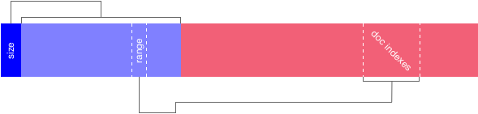

# A deep dive in meili-core

On the 21 of october 2018.

Meili-core is a full text search engine based on a final state transducer named [fst](https://github.com/BurntSushi/fst) and a key-value store named [RocksDB](https://github.com/facebook/rocksdb). The goal of a search engine is to store data and to respond to queries as accurate and fast as possible. To achieve this it must save the data as an [inverted index](https://en.wikipedia.org/wiki/Inverted_index).

## What is an index ?

For meili-core, an index is composed of a final state transducer, a document indexes file and some key-values.

### The final state transducer

This is the first entry point of the engine, you can read more about how it work with the beautiful blog post of burntsushi [Index 1,600,000,000 Keys with Automata and Rust](https://blog.burntsushi.net/transducers/).

To make it short it is a powerful way to store all the words that are present in the indexed documents. You construct it by giving all the words you want to index associated with a value that, for the moment, can only be an `u64`. When you want to search in it you can provide any automaton you want, in meili-core [a custom levenshtein automaton](https://github.com/tantivy-search/levenshtein-automata/) is used.

Note that the number under each word is auto-incremental, each new word have a new number that is greater than the prevous one.

Another powerful feature of `fst` is that it can nearly avoid using RAM and be streamed to disk, the problem is that the keys must be always added in lexicographic order, so you must sort them before, for the moment meili-core uses a [BTreeMap](https://github.com/Kerollmops/raptor-rs/blob/8abdb0a228e2808fe1814a6a0641a4b72d158579/src/metadata/doc_indexes.rs#L107-L112).

### The document indexes

As it has been specified, the `fst` can only store a number under a word an `u64` but the goal of the search engine is to retrieve a match in a document when a query is made. You want it to return so sort of position in an attribute in a document, an information about where the given word match.

To make it possible, a custom datastructure have been developped, the document indexes are stored in a file. this file is composed of two arrays , the first represent a range (i.e. start and end) that gives a view of where to read all the [DocIndexes]() corresponding to this number/word. The datastructure is pretty simple [to construct](https://github.com/Kerollmops/raptor-rs/blob/8abdb0a228e2808fe1814a6a0641a4b72d158579/src/metadata/doc_indexes.rs#L152-L200) and [to read](https://github.com/Kerollmops/raptor-rs/blob/8abdb0a228e2808fe1814a6a0641a4b72d158579/src/metadata/doc_indexes.rs#L48-L104). Another advantage is that the slices are accessible in `O(1)` when you know the word associated number.

### The key-value file

When the engine handle a query the result that the requester want is a document, not only the [match](https://github.com/Kerollmops/meili-core/blob/fc2cdf92596fc002ce278e3aa8718640ac44724d/src/lib.rs#L51-L79) associated to it, fields of the original document must be returned too.

So meili-core is backed by a key-value store named [RocksDB](https://github.com/facebook/rocksdb). At index time, the key-values of the documents are stored (if marked to be stored) using key structure of the form `{document id}-{field name}`. We wanted the index to be manipulable, RocksDB have a [file format](https://github.com/facebook/rocksdb/wiki/Creating-and-Ingesting-SST-files) that allow us to compute the index in advance.

The SST file have the same disadvantage as the fst, it needs its keys to be ordered.

## How a query is handled ?

Now that we have our index we are able to return results based on a query, in the meili-core universe a query is single string.

As we described it above, the logic imbrication of datastructures is schematized as the fst is queried with an automaton, this automaton returns words associated with a number and this number gives us documents indexes. We will not talk about the key-value store here.

### Query lexemes

The first step to be able to query to the underlying structures is to split the query in words, for that we use a [custom tokenizer](https://github.com/Kerollmops/meili-core/blob/fc2cdf92596fc002ce278e3aa8718640ac44724d/src/tokenizer/mod.rs) that is not finished for the moment, [there is an open issue](https://github.com/Kerollmops/meili-core/issues/3). Note that a tokenizer is based on a specific language, this is hard.

### Automatons and query index

So to query the fst we need an automaton, in meili-core we use a [levenshtein automaton](https://en.wikipedia.org/wiki/Levenshtein_automaton), this automaton is constructed using a string and a maximum distance. According to the [Algolia's blog post](https://blog.algolia.com/inside-the-algolia-engine-part-3-query-processing/#algolia%e2%80%99s-way-of-searching-for-alternatives) we [create the DFAs](https://github.com/Kerollmops/meili-core/blob/fc2cdf92596fc002ce278e3aa8718640ac44724d/src/automaton.rs#L62-L75) with different settings.

Thanks to the power of the fst library it is possible to union multiple automatons on the same index, it will allow us to know which [automaton returns a word according to its index](https://github.com/Kerollmops/meili-core/blob/fc2cdf92596fc002ce278e3aa8718640ac44724d/src/metadata/ops.rs#L111). The `Stream` is able to return all the numbers associated to the words in the fst.

We use the number to [find the whole list of `DocIndexes` associated](https://github.com/Kerollmops/meili-core/blob/fc2cdf92596fc002ce278e3aa8718640ac44724d/src/metadata/ops.rs#L129-L131) and [do a set operation](https://github.com/Kerollmops/meili-core/blob/fc2cdf92596fc002ce278e3aa8718640ac44724d/src/metadata/ops.rs#L135). For the moment, the only one that is used is the union of all the `DocIndexes` (all set operations are supported by `sdset`). It means that only positive indexes are supported not negative ones.

With all these informations it is possible to reconstruct a list of all the [DocIndexes](https://github.com/Kerollmops/meili-core/blob/fc2cdf92596fc002ce278e3aa8718640ac44724d/src/lib.rs#L25-L40) associated with the words queried.

### Sort by criteria

Know that we are able to get a big list of `DocIndexes` it is not enough to sort them by criteria, we need more informations like the levenshtein distance, the fact that the word match exactly. So we stuff it a little bit, and [aggregate all these Matches for each document](https://github.com/Kerollmops/meili-core/blob/fc2cdf92596fc002ce278e3aa8718640ac44724d/src/rank/ranked_stream.rs#L55-L78). This way it will be easy to sort a simple vector of document using a bunch of functions.

With this big list of documents and associated matches we are able to sort only the part of the slice that we want using bucket sorting, [currently the algorithm is not optimal](https://github.com/Kerollmops/meili-core/blob/fc2cdf92596fc002ce278e3aa8718640ac44724d/src/rank/ranked_stream.rs#L84-L101). Each [criterion](https://github.com/Kerollmops/meili-core/blob/fc2cdf92596fc002ce278e3aa8718640ac44724d/src/rank/criterion/mod.rs#L62-L72) is evaluated on each subslice without copy, thanks to [GroupByMut](https://github.com/Kerollmops/group-by/blob/master/src/lib.rs#L177-L182) which, I hope, [will soon be merged](https://github.com/rust-lang/rfcs/pull/2477).

🎉 meili-core work is over 🎉

